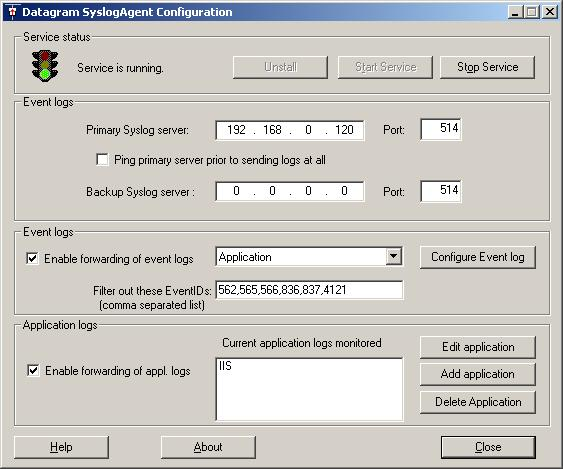

# SyslogAgent

SyslogAgent is a Windows add-on, allowing Windows EventLog events as well as other Windows applications logs to be sent to a syslog server. SyslogAgent is installed as a transparant service on Windows.

The SyslogAgent is a derivate of NTSyslog by SaberNet.net, and is shipped under the GNU license. Therefore, the software is freely downloadable and free to use.
The application logging functionality of SyslogAgent handles any logs that are text-based and uses one line per log entry. A wizard functionality suggests which configuration to use, or the user can manually configure the mapping from log file to syslog format. Most common logging formats on Windows (IIS, FTP etc) are automatically supported.

SyslogAgent has been significantly optimized compared to NTSyslog. Changes in the engine has resultet in several orders of magnitude faster parsing, which was needed for large volume installations. Communication with domain servers has also be minimized. Filtering based on EventIDs has also been introduced.

SyslogAgent has a security feature agains loss of data because of network availability. SyslogAgent will not transmit any logs when a reliable network connection to the SyslogServer is unavailable. When it does become available, all the accumulated event logs are transmitted. This feature is designed primarily for laptops, but is also to an advantage in an enterprise environment in case of network connectivity problems, or SyslogServer downtime. 
